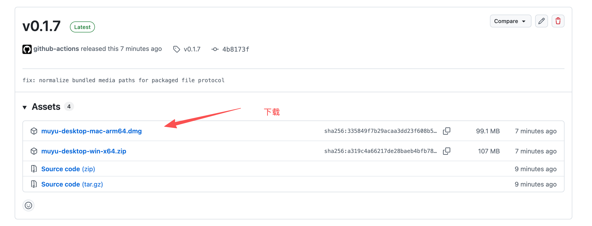
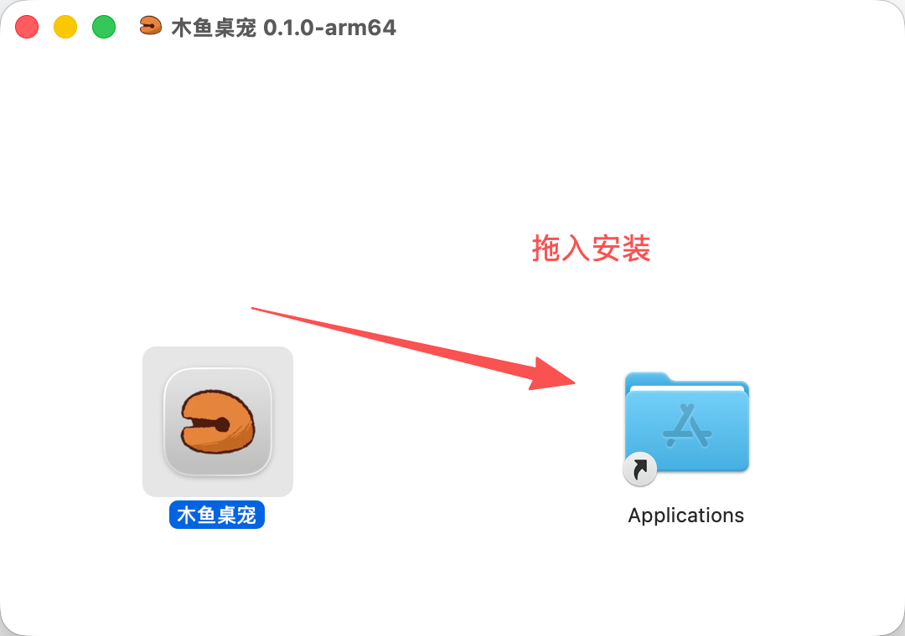
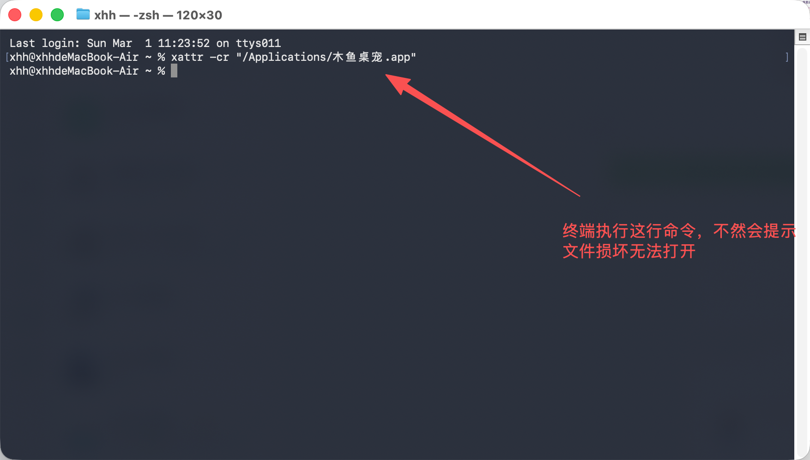
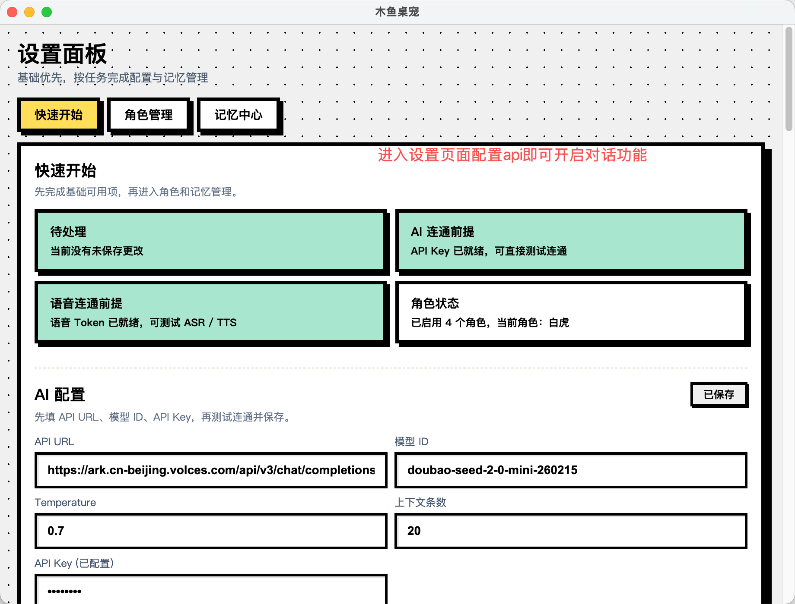

# 木鱼桌宠（muyu-desktop）

一个基于 Electron 的桌面宠物应用：可互动、可聊天、可语音输入输出，并支持记忆摘要与聊天数据导出。

## 适用平台

- macOS：`.dmg` 安装包（当前 Release 提供 Apple Silicon）
- Windows：`.zip` 便携包（x64）
- iOS：不支持（本仓库是桌面端 Electron 项目）

## 下载与安装

- 最新发布页：[Releases / latest](https://github.com/mn5449551-dot/muyu-desktop/releases/latest)
- Windows 下载：[muyu-desktop-win-x64.zip](https://github.com/mn5449551-dot/muyu-desktop/releases/latest/download/muyu-desktop-win-x64.zip)
- macOS 下载：[muyu-desktop-mac-arm64.dmg](https://github.com/mn5449551-dot/muyu-desktop/releases/latest/download/muyu-desktop-mac-arm64.dmg)

说明：

- 当前仓库为 `Public`，可直接下载 Release。
- Windows 目前提供便携版 zip（非安装向导）。

### macOS 安装步骤（DMG）

1. 在 Release 页面下载 `muyu-desktop-mac-arm64.dmg`。



2. 双击打开 DMG，把 `木鱼桌宠.app` 拖到 `Applications`。



3. 打开终端执行：

```bash
xattr -cr "/Applications/木鱼桌宠.app"
```



4. 再打开应用（建议首次使用“右键 -> 打开”）。



第 3 步说明（简版）：

- `xattr`：操作扩展属性
- `-c`：清空扩展属性
- `-r`：递归处理整个 `.app` 包
- 作用：清除常见的 `com.apple.quarantine` 下载隔离标记，避免 macOS 误判“已损坏”

## 功能概览

- 悬浮桌宠窗口与点击互动
- 独立聊天窗口（按角色隔离会话）
- 语音输入（ASR）与语音播报（TTS）
- 长期记忆摘要与档案冲突处理
- 设置面板与记忆管理面板
- 聊天/摘要/档案导出：Markdown、JSON、JSONL

## 源码开发（可选）

如果你只是下载 Release 安装包使用，可以跳过本节。

环境要求：

- Node.js + npm
- macOS 或 Windows

```bash
npm install
npm run rebuild-native
npm run dev
```

## API Key 配置（火山引擎）

默认能力：

- LLM（方舟）：`https://ark.cn-beijing.volces.com/api/v3/chat/completions`
- 语音（豆包）：ASR + TTS

获取入口（官方）：

- 火山方舟控制台（大模型 / LLM Key）：`https://console.volcengine.com/ark`
- 豆包语音快速入门（AppID / Access Token）：`https://www.volcengine.com/docs/6561/2119699`
- 音色列表（`voice_type` / `emotion`）：`https://www.volcengine.com/docs/6561/1257544`
- TTS V3 文档：`https://www.volcengine.com/docs/6561/1598757`
- ASR 流式文档：`https://www.volcengine.com/docs/6561/1354869`

应用内配置步骤：

1. 打开设置面板。
2. 在 AI 配置中填写 `API Key`（及 Base URL/Model）。
3. 在语音配置中填写 `AppID`、`Access Token`、`ASR 资源 ID`、`TTS 资源 ID`。
4. 点击保存并执行连接测试。

安全提醒：

- 不要把真实密钥提交到 GitHub。
- 本地密钥使用 Electron `safeStorage` 加密保存。

## 测试

```bash
npm run test:e2e
```

- Playwright 配置：`playwright.e2e.config.js`
- 报告目录：`artifacts/e2e/report`
- 测试产物：`artifacts/e2e/test-results`

## 发布（GitHub Actions）

发布流水线：`.github/workflows/release.yml`

触发方式：

1. 提交并推送代码到 `main`
2. 打标签并推送，例如：

```bash
git tag v0.1.5
git push origin v0.1.5
```

流水线行为：

- `macos-latest` 构建 `.dmg`
- `windows-latest` 构建 `.zip`
- 自动上传到对应 tag 的 GitHub Release

## 目录结构

- `src/main/`：主进程、IPC、数据库、服务
- `src/renderer/`：React 界面（桌宠/聊天/设置/记忆）
- `src/shared/`：共享 IPC 常量
- `src/utils/`：工具函数
- `assets/`：静态资源
- `tests/e2e/`：E2E 回归

## 常见问题

- 原生模块加载失败（`better-sqlite3`）
  - 执行 `npm run rebuild-native`
- Electron 启动但界面空白
  - 确认 `npm run start:vite` 在 `http://localhost:5173` 运行
- 聊天/语音请求失败
  - 检查设置中的 LLM 与语音凭据配置

## 开发约定

- 主进程：CommonJS（`require/module.exports`）
- 渲染进程：ESM + React
- 新增 IPC 时同步修改：
  - `src/shared/ipc-channels.js`
  - `src/main/main.js`
  - `src/main/preload.js`

最后更新：2026-03-01
