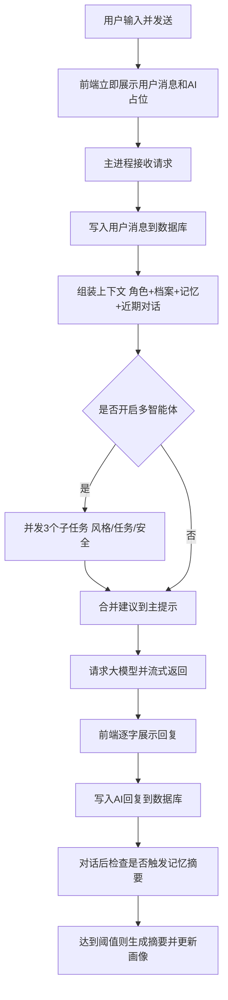
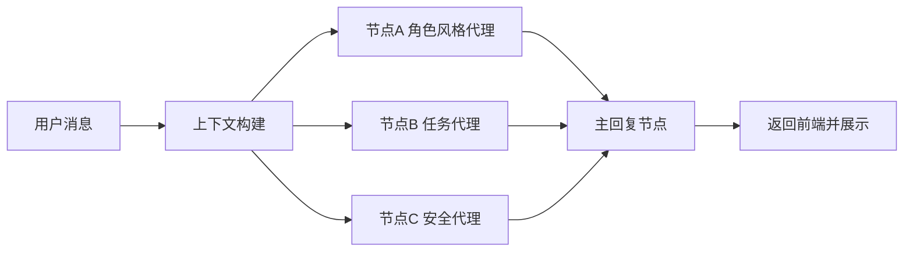
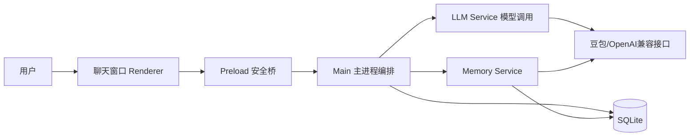
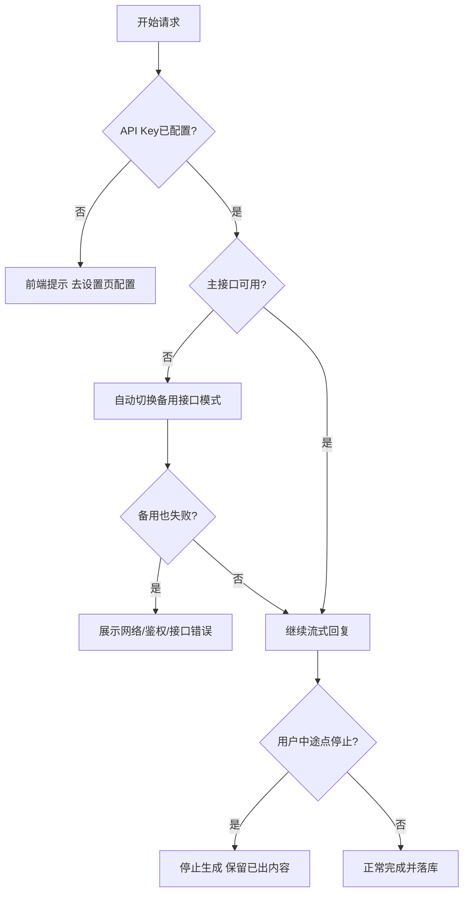

# 产品视角对话流程图（可直接评审）

> 面向产品经理：只讲用户可感知流程 + 系统关键分支  
> 更新时间：2026-02-28

---

## 1) 用户看到的流程（线框）

```text
┌──────────────────────────────────────────┐
│ 聊天窗口                                  │
│                                          │
│  历史消息区                               │
│  [用户] 今天有点焦虑                       │
│  [AI  ] （正在输入...）                    │
│                                          │
│  输入框: 说点什么...         [发送]        │
└──────────────────────────────────────────┘
                │
                ▼
      用户点击发送 / 回车发送
                │
                ▼
┌──────────────────────────────────────────┐
│ UI即时反馈                                │
│ - 立刻出现“用户消息”                       │
│ - 立刻出现“AI占位气泡”                     │
│ - 逐字流式显示AI回复                       │
└──────────────────────────────────────────┘
                │
                ▼
┌──────────────────────────────────────────┐
│ 结果态                                    │
│ - 成功：展示完整回复                       │
│ - 失败：展示可读错误文案                   │
└──────────────────────────────────────────┘
```

---

## 2) 端到端主流程图（产品可读）



---

## 3) 多智能体拆解图（1 条消息会发生什么）



开启时（当前开关=ON）：
- 一条消息通常是 `3 次子请求 + 1 次主请求 = 4 次模型调用`。

关闭时（当前开关=OFF）：
- 跳过 A/B/C 三个子节点，直接主回复节点，通常是 `1 次模型调用`。

---

## 4) 角色分工图（谁负责什么）



---

## 5) 异常分支图（产品最关心）



---

## 6) 多智能体开关的产品含义

- `关闭`：一次主模型直出，速度更快，结构化程度较弱。  
- `开启`：先做“风格/任务/安全”三路预分析，再生成主回复；通常更稳，但平均耗时更长。  
- 这不是豆包 API 自带“多智能体模式”，是你们应用层自己做的编排。

---

## 7) 你可以直接用来评审的检查点

1. 发送后 100ms 内是否看到“AI占位气泡”。  
2. 流式过程中是否稳定逐字更新、不卡住。  
3. 错误文案是否让用户知道“下一步做什么”。  
4. 多智能体开关前后，响应时延和回复质量是否符合预期。  
5. 记忆摘要触发后，下次对话是否体现“记住了用户信息”。
