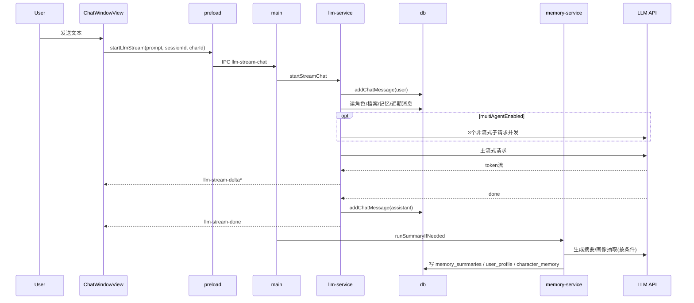

# 当前对话工作流与架构（代码实况）

> 更新时间：2026-02-28  
> 范围：当前仓库 `src/main/**` + `src/renderer/**` 的真实执行链路（非规划稿）

---

## 1. 一句话结论

- 当前“多智能体模式”不是豆包 API 的原生模式开关，而是本项目在主进程里做的应用层编排。
- 用户发起一次聊天时，链路是：前端发 IPC -> 主进程写入用户消息 -> 组装上下文 -> （可选）多智能体预规划 -> 流式请求模型 -> 回推前端 -> 落库助手消息 -> 触发记忆后处理。

---

## 2. 架构分层

### 2.1 Renderer（聊天 UI）

- 文件：`src/renderer/components/ChatWindowView.jsx`
- 职责：
  - 发送用户输入（`sendMessage`）
  - 监听流式事件（`onLlmDelta/onLlmDone/onLlmError`）
  - 本地维护临时消息占位与流式拼接展示

### 2.2 Preload（安全桥）

- 文件：`src/main/preload.js`
- 职责：
  - 暴露 IPC API：`startLlmStream / getChatRecent / cancelLlm`
  - 暴露事件订阅：`onLlmDelta / onLlmDone / onLlmError / onChatReload`

### 2.3 Main（编排中枢）

- 文件：`src/main/main.js`
- 职责：
  - 注册 `llm-stream-chat` IPC handler
  - 调用 `llmService.startStreamChat`
  - 在回复完成后触发 `memoryService.runSummaryIfNeeded`

### 2.4 LLM Service（模型调用层）

- 文件：`src/main/services/llm-service.js`
- 职责：
  - 构建运行时上下文（角色/档案/记忆/近期对话）
  - 可选执行三代理规划（角色风格/任务/安全）
  - 处理流式 SSE、错误分类、回退模式（chat/responses）

### 2.5 DB + Memory Service（持久化与记忆）

- 文件：`src/main/db.js`、`src/main/services/memory-service.js`
- 职责：
  - 聊天消息、记忆摘要、画像字段存储
  - 自动摘要阈值触发、每日上限、关系阶段推进、定期画像抽取

---

## 3. 一次用户对话的完整数据流（当前执行）

### 3.1 前端发起

1. 用户点击发送，进入 `sendMessage`。  
   位置：`ChatWindowView.jsx` `sendMessage`（约 1157 行）
2. 前端先插入本地临时消息（user + assistant 占位），再调用：
   - `window.electronAPI.startLlmStream(text, sessionId, charId)`

### 3.2 IPC 到主进程

1. `ipcMain.handle('llm-stream-chat')` 接收请求。  
   位置：`main.js`（约 925 行）
2. 转给 `llmService.startStreamChat({...})`，并挂 `onAfterDone` 回调用于记忆摘要。

### 3.3 写入用户消息

1. `startStreamChat` 首先执行 `db.addChatMessage('user', text, sessionId)`。  
   位置：`llm-service.js`（约 352 行）
2. 用户消息在发模型前已入库（`chat_messages`）。

### 3.4 构建模型上下文

`buildRuntimeContext` 按顺序拼接：

1. 角色系统提示词 `chatSystemPrompt`
2. 用户档案（若存在）
3. 关系阶段（若非 `new`）
4. 最近记忆摘要（最多 5 条）
5. 最近聊天消息（`maxContext`）

对应位置：`llm-service.js` 53-87 行。

### 3.5 可选：多智能体预规划

当 `multiAgentEnabled=true`（`db.getLlmCredentials()` 读取）时：

1. 并发 3 次非流式子调用：
   - 角色风格代理
   - 任务代理
   - 安全代理
2. 把三段结果合并成一个系统消息，追加到主请求 messages。

对应位置：`llm-service.js` 304-342、500-514 行。

说明：
- 这是项目侧“多次调用 + 融合”的策略，不是 API 自带单请求多代理能力。

### 3.6 主回复流式生成

1. 进入 `streamLoop`，按 URL 形态选择模式候选：
   - `chat/completions`
   - `responses`（失败时可切换）
2. 发起 SSE 流式请求，逐 token 向前端发送 `llm-stream-delta`。
3. 结束后发送 `llm-stream-done`；异常发送 `llm-stream-error`。

对应位置：`llm-service.js` 439-571 行。

### 3.7 写入助手消息

- 有有效文本时执行 `db.addChatMessage('assistant', assistantText, sessionId)`。  
  位置：`llm-service.js` 547-549 行。

### 3.8 对话后处理（记忆链路）

由 `onAfterDone` 触发：

1. `memoryService.runSummaryIfNeeded({ threshold: 20, maxMessages: 40 })`
2. 达阈值则生成摘要并写入 `memory_summaries`
3. 更新 `character_memory`（`summaryCount`、`relationshipStage`）
4. 每 3 次摘要触发一次用户画像抽取并合并到 `user_profile`

对应位置：
- `main.js` 935-941 行
- `memory-service.js` 58-199 行

### 3.9 前端展示闭环

1. `onLlmDelta`：把 token 持续拼接到 assistant 占位消息
2. `onLlmDone`：收尾、可触发语音播报
3. `onLlmError`：写入可读错误信息

对应位置：`ChatWindowView.jsx` 972-1047 行。

---

## 4. 当前关键配置开关

- `llm_multi_agent_enabled`：是否开启三代理预规划（默认 true）
- `llm_base_url` / `llm_model` / `llm_temperature` / `llm_max_context`
- `memory_summary_system_prompt`：摘要系统提示词（可覆盖默认）
- `proactive_enabled`：是否允许主动发话（与用户主动发送链路并行存在）

来源：`src/main/db.js`、`src/main/main.js`

---

## 5. 当前数据落库点

- 聊天消息：`chat_messages`
  - 用户消息：主请求前落库
  - 助手消息：流式完成后落库
- 记忆摘要：`memory_summaries`
- 画像：`user_profile`
- 关系记忆：`character_memory`
- 运行配置：`app_state`

---

## 6. 异常与降级策略（当前实现）

- 接口模式降级：
  - 一个模式失败且命中可重试状态码（如 404/405/415/422）时，自动切另一模式。
- 流式异常分类：
  - `auth / endpoint / timeout / network / unknown`
- 多智能体子请求失败：
  - 会回退到“无多智能体增强”的主链路，不阻塞回复。
- 前端取消：
  - 调用 `llm-cancel`，主进程 `AbortController` 中断请求。

对应位置：`llm-service.js` 131-197、280-302、515-517、573-579 行。

---

## 7. 时序图（简化）

---

## 8. 边界说明（避免误解）

- 当前并不是“先单独过一层审核模型再展示给前端”的双模型串行网关。
- 当前是“可选前置规划 + 主模型直接流式回传前端”。
- 如果未来要改成“主回复模型 + 审核/改写模型”双模型流水线，需要在 `streamLoop` 前后新增二次调用与延迟策略。
