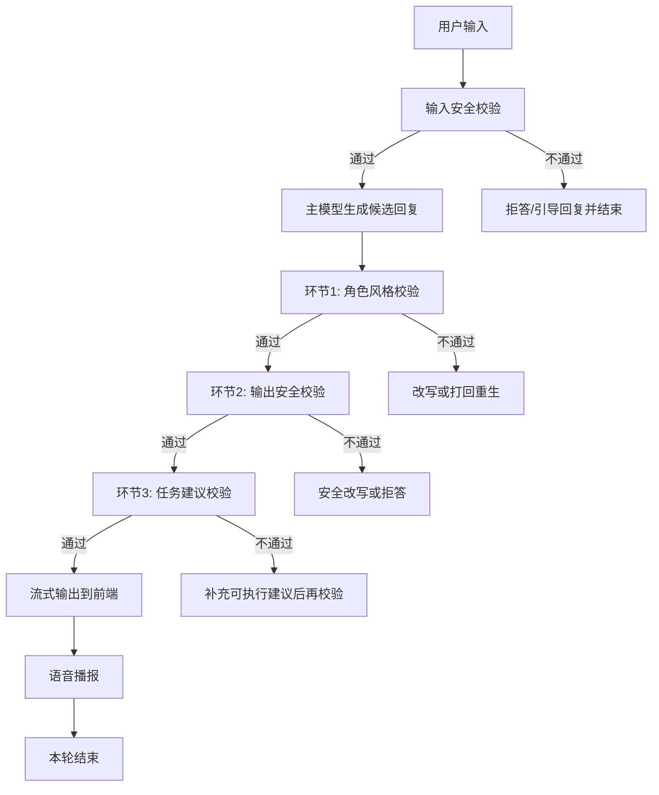
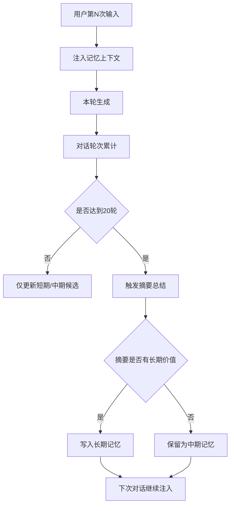

# 多智能体与记忆流程（产品口径重梳理）

> 更新时间：2026-02-28  
> 目标：按你当前定义重梳理“用户输入 -> 模型处理 -> 输出 -> 记忆沉淀”的完整路径。

## 1) 你定义的正常完整路径（不出错）

## 2) “任务建议”到底是什么

`任务建议` 的作用是把回复从“像在聊天”提升为“能执行的帮助”，核心检查点：

1. 是否识别了用户当前真正目标（不是只复述）
2. 是否给出下一步动作（可执行、可落地）
3. 是否避免空泛鼓励（如只有情绪安抚，没有行动）

一句话定义：
- `任务建议 = 可执行性守门员`，保证回复不只“像人设”，还“能帮用户做事”。

## 3) 记忆机制（按你的目标口径）

## 4) 中期记忆触发逻辑（你关心的点）

从产品视角，建议明确为：

1. 触发条件：
- 到达固定轮次阈值（如 20 轮）
- 或命中关键事件（目标变化、偏好确认、长期约束）

2. 触发结果：
- 生成“中期摘要条目”，用于近期会话召回
- 并做一次“是否升级长期记忆”的判断

3. 召回策略：
- 下轮优先注入与当前问题最相关的 2-3 条中期记忆
- 与当前输入冲突时，以当前输入为准

## 5) 与当前代码现状的关键差异（你做决策要知道）

当前实现里，多智能体是“主生成前的三路规划”，不是“主生成后的三道校验门”。

- 当前：
1. 输入安全（规则）
2. （可选）三代理并发规划
3. 主模型流式生成
4. 输出分段守卫（安全/风格改写）

- 你要的：
1. 输入安全
2. 主模型先生成
3. 三道后置校验（风格/安全/任务）
4. 通过后再流式输出

这两者本质区别是：
- 一个是 `前置规划`
- 一个是 `后置门控`

## 6) 你这版流程的一个实现注意点（产品层）

如果严格要求“三道校验都通过后再流式输出”，会天然增加首字延迟。

可接受的折中是：
1. 先生成首段
2. 对首段做快速三校验通过后立刻开始流式
3. 后续分段继续滚动校验

这样能兼顾体验速度与质量控制。
