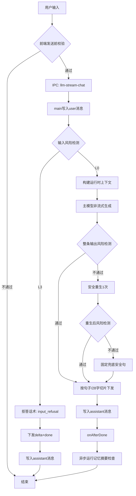
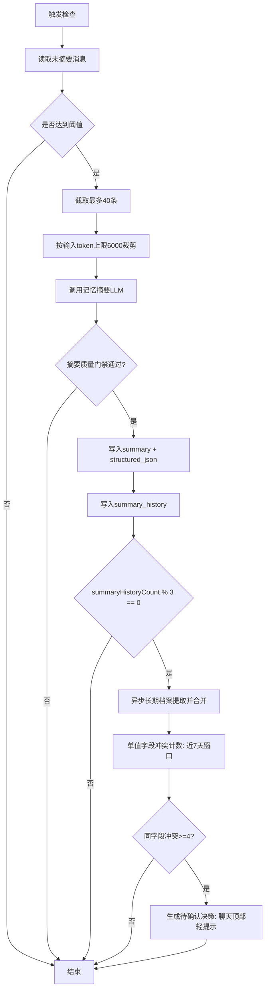

# 用户对话全路径与边界情况处理流程（当前生效真值）

> 核对时间：2026-02-28
> 口径：仅记录当前代码与本机运行配置的真实行为。

## 1) 用户输入到回复完成（当前主链路）



当前接口模式真实含义：
- 主模型只调用同一个供应商 API。
- `mode` 只表示路由兼容切换：`/chat/completions` 与 `/responses`。
- 不是三个独立模型节点。

当前多智能体开关真实状态：
- `llm_multi_agent_enabled` 配置存在。
- 当前 `llm-service.js` 主链路没有按该开关分支到“三代理流程”。

## 2) 记忆触发与执行（当前代码）

触发时机与阈值：
- 自动触发：每次 assistant 回复完成后检查，条件是未摘要消息数 `>= 20`。
- 退出前触发：应用退出前检查，条件是未摘要消息数 `>= 10`。
- 手动摘要入口：已下线。

展示策略（当前生效）：
- 设置页默认仅展示最近 `5` 条中期摘要（按角色、时间倒序）。
- 可点击“查看全部”打开独立记忆窗口，窗口内支持关键词/时间筛选与分页浏览。
- 仅限制展示，不删除历史摘要数据。

记忆执行流程：



## 3) 真实提取字段与真实保存字段

### 3.1 中期记忆摘要

LLM输入内容：
- system：`memory_summary_system_prompt` 当前值。
- system：结构化输出约束提示词（固定内置）。
- user：`会话ID: {sid}\n请总结以下对话：\n{input}`。
- `input` 是未摘要消息按 `[role] content` 拼接后的文本。

LLM输出要求（当前实现）：
- 目标输出：严格 JSON 对象，字段为：
  - `summary_text`
  - `facts`
  - `preferences`
  - `goals`
  - `constraints`
  - `todos`
  - `risks`
  - `confidence`
- 如果解析失败：自动进行一次 JSON 修复重试。
- 如果仍失败：本轮摘要会被质量门禁丢弃，不写中期记忆。

写入表 `memory_summaries` 字段：
- `id`
- `summary`
- `structured_json`（结构化摘要 JSON 字符串，可空）
- `from_msg_id`
- `to_msg_id`
- `ts`
- `session_id`
- `deleted_at`（软删除标记）

写入表 `summary_history` 字段：
- `id`
- `session_id`
- `summary_text`
- `from_msg_id`
- `to_msg_id`
- `input_tokens`
- `output_tokens`
- `created_at`

### 3.2 长期档案提取

LLM输出 JSON 字段（固定）：
- `name`
- `occupation`
- `birthday`
- `birthday_year`
- `traits`（数组）
- `notes_append`

校验与兜底：
- 先按 JSON 解析并做字段 schema 归一化。
- 若首轮不合法，自动执行一次 JSON 修复重试。
- 仍不合法则放弃本轮档案合并（不写脏数据）。

写入 `user_profile` 的真实规则：
- `name`：仅当提取值非空且现有 `name` 为空时写入。
- `occupation`：仅当提取值非空且现有 `occupation` 为空时写入。
- `birthday`：仅当匹配 `MM-DD` 且现有 `birthday` 为空时写入。
- `birthday_year`：仅当为正整数且现有 `birthday_year` 为空时写入。
- `traits`：与现有 traits 去重合并，写回逗号分隔字符串。
- `notes_append`：非空即追加到 `notes`，分隔符是 `\n---\n`。

冲突检测（当前生效）：
- 仅检测单值字段：`name / occupation / birthday / birthday_year`。
- 当提取值与现有值均非空且不一致时，记录为一次冲突事件（不会直接覆盖）。
- 统计窗口：最近 7 天。
- 触发阈值：同一字段冲突次数 `>= 4` 时，生成“待确认决策”。
- 候选新值：近 7 天冲突新值中的多数值（并列时取最新）。
- 用户入口：聊天窗口顶部轻提示（保留原值 / 更新为新值 / 稍后处理）。
- `保留原值` 后同候选值进入 30 天静默期，避免重复打扰。

`user_profile` 当前实际可能存在的 key：
- `name`
- `occupation`
- `traits`
- `notes`
- `birthday`
- `birthday_year`

### 3.3 中期摘要质量门禁

门禁规则（当前生效）：
- 必须有结构化摘要对象（`structured_json`），否则丢弃。
- 噪声输入/输出（如 `[object Object]`、无意义内容复述、`/clear` 碎片）会被丢弃。
- 结构化内容中至少要有可执行信息（`preferences/goals/constraints/todos/risks` 任一非空），否则丢弃。

## 4) 当前生效提示词原文

### 4.1 当前角色系统提示词（当前角色=木鱼）

```text
你是木鱼桌宠，语气平静、温和、略带幽默。每次回复 1-3 句，优先帮助用户放松和专注，避免空话。
```

### 4.2 记忆注入策略提示词

```text
你在回复时必须遵守以下记忆使用优先级：
1) 用户当前输入（本轮）；
2) 最近对话上下文；
3) 用户档案（稳定信息）；
4) 阶段记忆摘要（中期）。

执行规则：
- 若历史记忆与当前表达冲突，以当前表达为准。
- 记忆仅用于提升理解，不要生硬复读。
- 未被明确证实的信息，不得当作事实陈述。
- 对敏感或高风险话题，优先给温和、可执行、低风险建议。
```

### 4.3 输入拒答话术

```text
这个请求我不能直接帮你处理。我们可以换成安全、合法的方式来解决，我也可以陪你一起拆解可执行的下一步。
```

### 4.4 输出安全重生系统提示词

```text
请基于角色设定重写一版完整回复。要求：不得包含种族歧视煽动、国家主权攻击煽动等高风险表达；语气自然、简短、可执行。
```

### 4.5 输出兜底安全句

```text
这个话题我不能这样回答，但我可以帮你换个安全、可执行的方向。
```

### 4.6 中期记忆提取系统提示词（当前 app_state 实值）

```text
你是中期记忆提取器。仅提炼近期可执行信息：目标、待办、约束、偏好、风险。忽略寒暄、身份重复确认、无意义字符。不得编造，输出内容必须可被下一轮对话直接使用。
```

### 4.7 摘要请求模板（user）

```text
会话ID: {sid}
请总结以下对话：
{input}
```

### 4.7b 摘要结构化输出约束（system，固定内置）

```text
你是记忆结构化提取器。必须输出严格 JSON 对象，不要输出任何额外文字、markdown、解释。
字段要求：
- summary_text: string，1-120字，概括本轮要沉淀的关键信息
- facts: string[]，最多8条
- preferences: string[]，最多8条
- goals: string[]，最多8条
- constraints: string[]，最多8条
- todos: string[]，最多8条
- risks: string[]，最多8条
- confidence: number，0~1
若无内容请输出空数组，禁止编造。
```

### 4.7c 摘要 JSON 修复提示词（system，失败重试时触发）

```text
你是 JSON 修复器。请把给定内容修复为合法 JSON 对象，并严格符合指定字段：
summary_text, facts, preferences, goals, constraints, todos, risks, confidence。
禁止输出 JSON 以外内容。
```

### 4.8 长期档案提取提示词

```text
从以下对话中提取用户信息。
规则：
- 只提取对话中明确出现的内容，不推断，不猜测
- 没有的字段输出 null 或 []
- birthday 格式为 MM-DD（如 03-15），没有则 null
- birthday_year 为数字（如 1995），没有则 null

输出 JSON（不要输出其他内容）：
{
  "name": "...",
  "occupation": "...",
  "birthday": "...",
  "birthday_year": null,
  "traits": ["...", "..."],
  "notes_append": "..."
}

对话：
{conversationText}
```

### 4.8b 长期档案 JSON 修复提示词（system，失败重试时触发）

```text
你是 JSON 修复器。请把给定内容修复为合法 JSON 对象，并严格符合字段：
name, occupation, birthday, birthday_year, traits, notes_append。
禁止输出 JSON 以外内容。
```

### 4.9 主动发话原因提示词

生日触发：
```text
今天是用户的生日，请以真诚温暖的方式向用户送上生日祝福。
```

缺席触发：
```text
用户已 {daysSince} 天没有打开应用，请主动问候，表达想念或关心，语气自然不刻意。
```

## 5) 当前未进入主链路的提示词/配置

- `OUTPUT_SAFETY_REWRITE`：已在 `prompt-catalog` 定义，当前 `llm-service` 未调用。
- `OUTPUT_STYLE_REWRITE`：已在 `prompt-catalog` 定义，当前 `llm-service` 未调用。
- `llm_multi_agent_enabled`：当前作为配置项存在，主链路未按该开关执行三代理提示词流程。
- `profile_pinned_keys_json`：仍保留兼容存储，但设置页不再展示字段置顶入口，主流程按“补空不覆盖 + 冲突询问”执行。

## 6) 核对来源

- 代码：
  - `src/main/services/llm-service.js`
  - `src/main/services/memory-service.js`
  - `src/main/db.js`
  - `src/main/prompts/prompt-catalog.js`
  - `src/main/main.js`
- 运行配置：
  - `~/Library/Application Support/muyu-desktop/muyu.db`

## 7) 错误事件负载（当前生效）

`llm-stream-error` 与 `voice-stream-error` 统一输出以下字段：
- `requestId`
- `sessionId`（语音链路有值，LLM 链路通常为空）
- `source`：`llm` / `voice_asr` / `voice_tts` / `unknown`
- `message`
- `aborted`
- `kind`：`missing_key | auth | timeout | endpoint | network | provider | unknown | aborted | asr_no_text | audio_format`
- `reasonCode`：稳定机器码，例如 `llm_auth_invalid_key`、`voice_asr_no_text`
- `retryable`
- `status`（HTTP 状态码或 null）
- `mode`（如 `chat` / `responses` / `stream`）

前端处理口径：
- 优先用 `kind/reasonCode/source` 决定说明与建议。
- 仅在旧 payload 缺少这些字段时，才回退到 message 正则推断。

## 8) 导出格式（当前生效）

导出接口当前会同时产出三个文件：
- `*.md`：可读版导出（用户档案、会话对话、记忆摘要）。
- `*.json`：结构化对象导出（`meta/profile/sessions/chats/summaries`）。
- `*.jsonl`：兼容导出（每行一条 JSON 记录）。

其中摘要相关字段：
- `summary_text`：摘要主文本（来自 `memory_summaries.summary`）。
- `structured`：结构化摘要对象（由 `memory_summaries.structured_json` 解析得到；为空时为 `null`）。

导出口径命名（当前）：
- “阶段记忆摘要（中期）” = `memory_summaries`（会话阶段性沉淀）。
- “长期记忆” = `user_profile`（稳定档案字段快照：如 `name/occupation/traits/notes/birthday/birthday_year`）。
